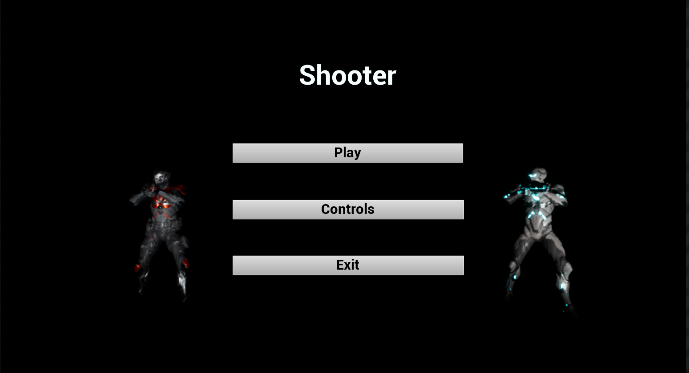
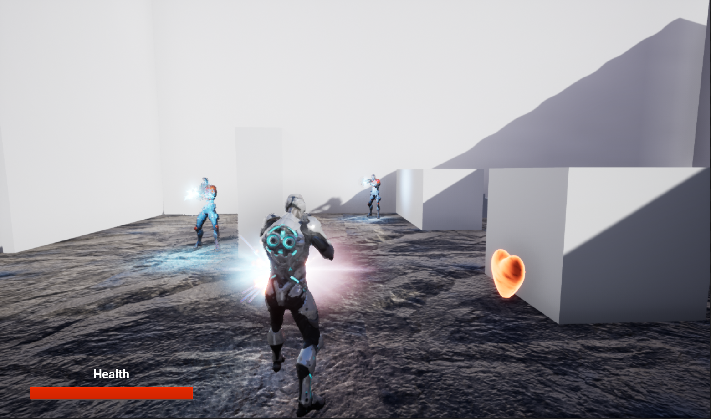
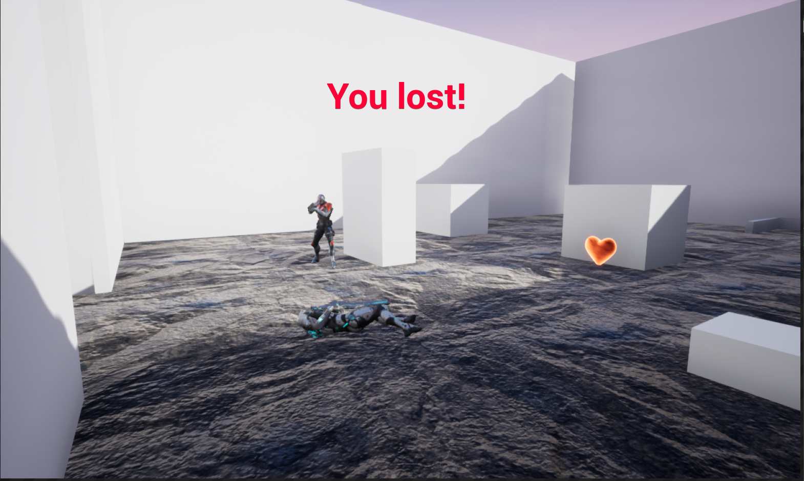
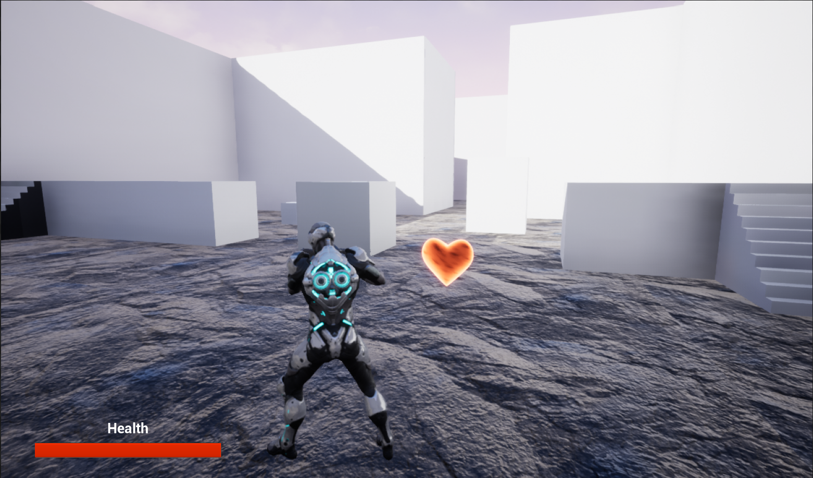
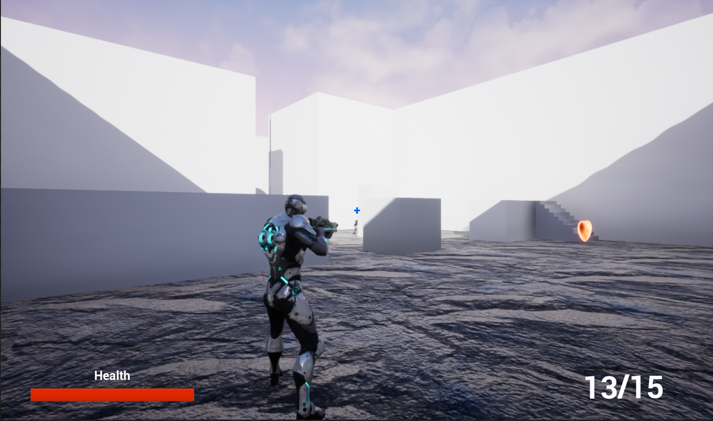
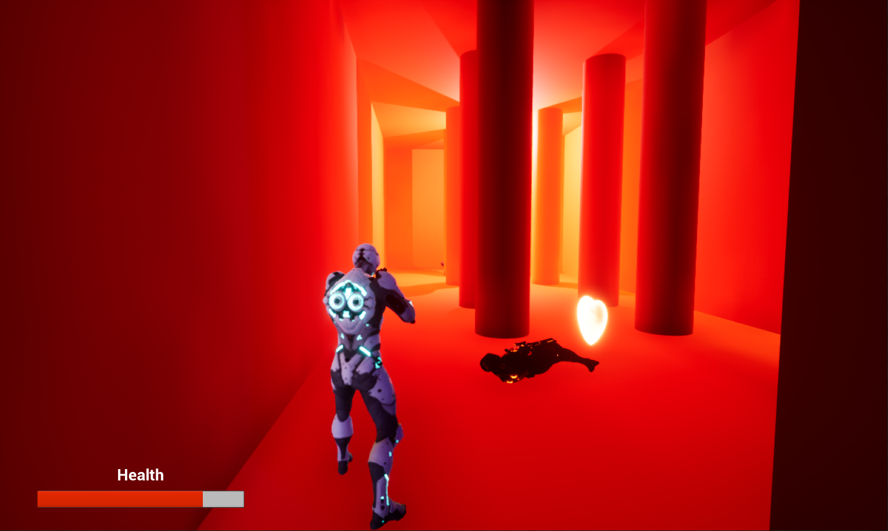

# Shooter

3D shooter created in Unreal Engine 4.27 in C++. The goal of the game is to kill all of the enemies. A player has third person view, the camera is only locked in straight line behind the character while aiming. Controls are explained in the game.

## Contributors
- Xenono
- Freecurse 

## Game rules and information
- Shooting is not possible while running.
- Magazine has 15 rounds, has to be reloaded to continue shooting.
- The player and enemies can pickup Gold Hearts that restore some of their health.
- All of the characters always walk while aiming.

## **Menu Snapshot**

## **Combat snapshot**

## **Lose Screen snapshot**

## **Health Pickup snapshot**

## **Aiming snapshot**

## **Gameplay snapshot**

## Sounds used and their authors
1. Steaming sound https://freesound.org/people/bumpelsnake/sounds/456603/
2. Error sound https://freesound.org/people/distillerystudio/sounds/327737/
    
